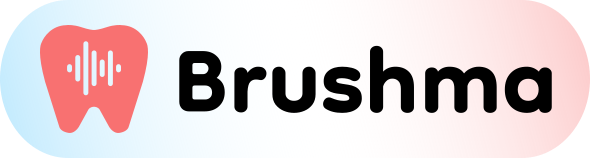

  

> __A Next.js web app for creating a tooth-brushing playlist using the Spotify API.__

## What's Brushma?

___Brushma teeth!___

The American Dental Association recommends brushing your teeth for two minutes twice a day ([source](https://www.ada.org/resources/research/science-and-research-institute/oral-health-topics/toothbrushes)).

Brushma scans your Spotify library and creates a playlist of songs perfect to brush your teeth to.
The default is songs from 2 minutes to 2 minutes and 15 seconds, but these times can be adjusted to your liking.
Simply sign in with your Spotify account, select your desired time range, and Brushma will generate a playlist for you.

## Permissions

In order to take actions on your behalf on Spotify, Brushma needs two permissions (a.k.a. scopes):
  - _playlist-modify-private_: The ability to manage your private playlists.
  - _user-library-read_: The ability to access your saved content.

These permissions are as limited as possible while still allowing the app to work.
Ideally, Brushma would only have permission to modify playlists it has created, but that's unfortunately not how the Spotify API works.

Read more about Spotify API scopes [here](https://developer.spotify.com/documentation/web-api/concepts/scopes).

## Data Collection

Brushma does not store any user data.
Requests are passed from your browser to Brushma's server which in turn makes requests to the Spotify API.
Of course, any Spotify API requests are subject to Spotify's data collection practices. See [Spotify's Privacy Center](https://www.spotify.com/us/privacy) for more info. 

Your user access token (the token needed to take actions on your behalf on Spotify) is stored in your browser as a cookie.
This cookie is stored as a signed JSON Web Token (JWT), which is signed and verified on the server using a secret key.

## Tools Used

Brushma runs on [Next.js 13.4](https://nextjs.org/blog/next-13-4), using the App Router.

[TailwindCSS](https://tailwindcss.com/) is used across the app for styling.

The Brushma logo was created with [Figma](https://www.figma.com/) using images from [Flaticon.com](https://www.flaticon.com).

## License
Brushma is released under the [MIT License](/LICENSE.md).